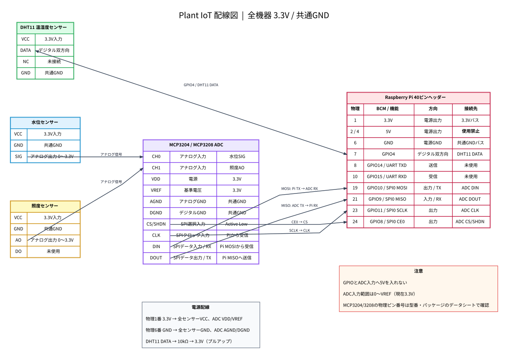

# Plant IoT 2台構成の配線

2台は別の設置場所で独立して計測し、同じSupabaseへ`device_id`付きで送信します。



## raspi（設置場所A）

| 機器 | 信号 | Raspberry Pi |
|---|---|---|
| DHT11 | `DATA` | GPIO17 / 物理ピン11 |
| DS18B20 | `DATA`（黄） | GPIO4 / 物理ピン7 |
| 水位センサー | `SIG` | MCP3204/MCP3208 `CH0` |
| CdS照度センサー | `AO` | MCP3204/MCP3208 `CH1` |
| ADC | `DIN` | GPIO10 / MOSI / 物理ピン19 |
| ADC | `DOUT` | GPIO9 / MISO / 物理ピン21 |
| ADC | `CLK` | GPIO11 / SCLK / 物理ピン23 |
| ADC | `CS/SHDN` | GPIO8 / CE0 / 物理ピン24 |
| LED | アノード | GPIO23から220Ω抵抗を介して接続 |
| LED | カソード | GND |

- DHT11のDATAと3.3Vの間に10kΩプルアップ抵抗を接続する。
- DS18B20のDATAと3.3Vの間に4.7kΩプルアップ抵抗を接続する。
- LEDはGPIO23とアノードの間に220Ω程度の電流制限抵抗を入れる。
- ADCと各センサーは3.3Vで使用し、全機器のGNDを共通化する。

## raspberrypi2（設置場所B）

| 機器 | 信号 | Raspberry Pi |
|---|---|---|
| BH1750 | `SDA` | GPIO2 / 物理ピン3 |
| BH1750 | `SCL` | GPIO3 / 物理ピン5 |
| BH1750 | `ADDR` | GND（I2Cアドレス`0x23`） |
| DS18B20 | `DATA`（黄） | GPIO4 / 物理ピン7 |
| フロートスイッチ | 片側 | GPIO17 / 物理ピン11 |
| フロートスイッチ | もう片側 | GND |

- BH1750モジュールは3.3Vで使用する。通常は追加抵抗不要。
- DS18B20のDATAと3.3Vの間に4.7kΩプルアップ抵抗を接続する。
- フロートスイッチはGPIO17の内部プルアップを使用し、5Vへ接続しない。
- GPIO17は実機確認で`hi`と`lo`の切り替わりを確認済み。
- `lo`を水不足として扱うが、フロートの設置方向によって意味が逆転するため、最終設置時に確認する。

## raspberrypi2のOS設定

`/boot/firmware/config.txt`でI2Cと1-Wireを有効にします。

```ini
dtparam=i2c_arm=on
dtoverlay=w1-gpio,gpiopin=4
```

再起動後の確認:

```bash
i2cdetect -y 1
ls /sys/bus/w1/devices/28-*/w1_slave
python debug_bh1750.py
python debug_ds18b20.py
python debug_float_switch.py
```

## 図の再生成

```bash
python scripts/generate_wiring_diagram.py
```
